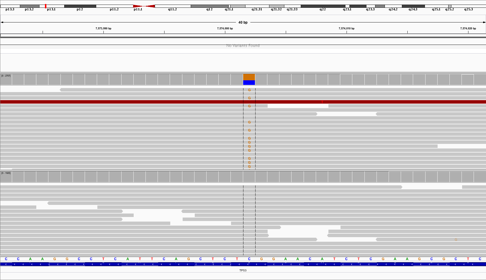
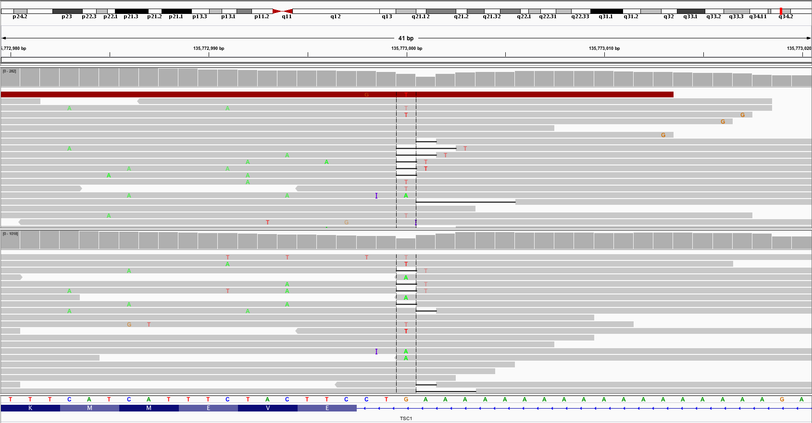

MuTect2 Pitfalls
================

The standard parameters in MuTect2 (GATK v3.7) are very strict. For example, a somatic variant (no matter its frequency in the tumor sample) is discarded if the variant is seen in more than one read in the normal sample. This is particularly problematic for panel sequencing with read depths >1000X in targeted regions.

We propose solving this issue by raising the values of two MuTect2 parameters as indicated in the table below. By setting `max_alt_alleles_in_normal_count` to a very high number (there is no option to completely disable the filter), we never discard variants based on the absolute count of ALT alleles in the normal sample. Furthermore, we allow up to 10% of the normal reads to contain the ALT allele.

==================================== ======= ==========
Parameter                            Default Proposed
==================================== ======= ==========
max_alt_alleles_in_normal_count      1       10000000
max_alt_allele_in_normal_fraction    0.03    0.10
==================================== ======= ==========

These more relaxed settings inevitable lead to an increased number of false positives. We filter those using custom filters (described below).

Motivation
----------

The IGV screenshot below shows an example of a variant in TP53 which is not called by MuTect2 with default parameters. The allele frequency in the normal sample is 58% (1528/2634). However, the variant is filtered out by MuTect2, because it fails both filters above. The allele frequency in the tumor sample is 1.1% (21/1920).

Downstream Filters
------------------

Or course, by raising the paramter cut-offs, we naturally get a larger number of false positives. For example, the TSC1 variant in the screenshot below is not filtered by MuTect2, although it is clearly noise.

Another typical cause of false positives is similar allele frequencies in tumor and normal. MuTect2 will call variants in tumor somatic, as long as their frequencies in the normal sample are not above the 10% cut-off. In some cases, we therefore end up calling somatic variants with higher allele frequencies in the normal than in the tumor!
